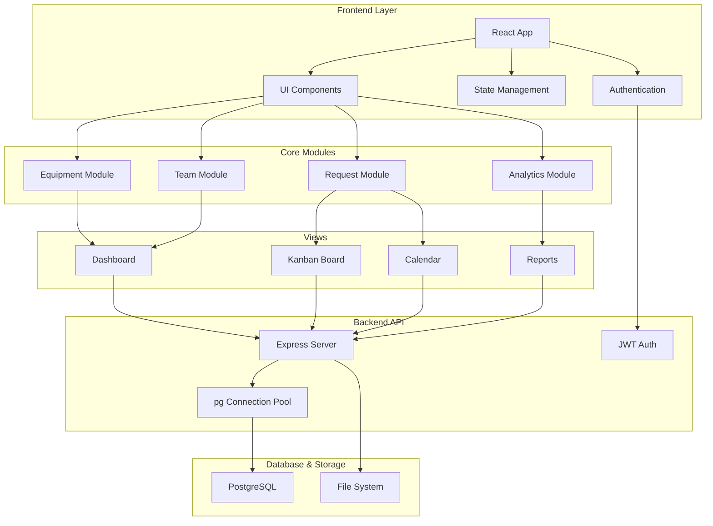

# GearGuard - Maintenance Management System Implementation Plan

## Problem Analysis

Organizations face critical challenges in asset maintenance:
- **Fragmented tracking**: Equipment, teams, and maintenance work are disconnected
- **Reactive approach**: Breakdowns handled inefficiently, poor preventive planning
- **Unclear accountability**: No clear ownership or responsibility assignment
- **Data gaps**: Historical maintenance data is hard to trace
- **Manual processes**: Lack of automation and systematic workflows

## Solution Overview

**GearGuard** is a centralized maintenance management system that provides:
- Unified equipment registry with team assignments
- End-to-end maintenance request workflow
- Visual operational tools (Kanban boards, calendars)
- Preventive maintenance scheduling
- Complete audit trail and analytics

## Design Analysis

Based on the problem statement and requirements, the system includes:
- **Dashboard**: Overview with key metrics and charts
- **Equipment Management**: List/grid views with filters
- **Kanban Board**: Visual workflow management
- **Calendar View**: Scheduled maintenance timeline
- **Request Forms**: Detailed issue reporting
- **Team Assignment**: Clear responsibility mapping

---

## Technology Stack

### Frontend
- **Framework**: React 18+ with Vite
- **Styling**: Tailwind CSS with custom design system
- **Routing**: React Router v6
- **State Management**: React Context API + useReducer (or Zustand for scalability)
- **Forms**: React Hook Form + Zod validation
- **UI Components**: 
  - Headless UI for accessible components
  - React DnD for Kanban drag-and-drop
  - FullCalendar for calendar views
  - Recharts for analytics
- **HTTP Client**: Axios for API calls
- **Date Handling**: date-fns
- **Icons**: Lucide React

### Backend - PostgreSQL with Custom Schema
**Stack**:
- **Database**: PostgreSQL (local instance)
- **Backend Framework**: Node.js + Express + TypeScript
- **Database Library**: node-postgres (pg) - direct SQL queries
- **Schema**: Custom `gearguard_schema_patched.sql` with triggers and views
- **Authentication**: JWT with bcrypt for password hashing
- **API**: RESTful API architecture

**Why This Approach?**
- ✅ **Custom Schema**: Uses your existing `gearguard_schema_patched.sql`
- ✅ **Full Control**: Direct SQL queries, leverage all PostgreSQL features
- ✅ **Triggers Work**: Auto-fill, scrap logic, overdue flags all functional
- ✅ **No ORM Overhead**: Maximum performance with connection pooling
- ✅ **Type Safety**: TypeScript interfaces match exact schema
- ✅ **Production Ready**: Battle-tested pg library

### Development Tools
- TypeScript for type safety
- ESLint + Prettier for code quality
- Vitest for unit testing
- Playwright for E2E testing

---

## System Architecture



---

## Data Models (From gearguard_schema_patched.sql)

### Core Tables

#### Company
```typescript
interface Company {
  id: string;
  name: string;
  created_at: Date;
  updated_at: Date;
}
```

#### Department
```typescript
interface Department {
  id: string;
  company_id: string;
  name: string;
  created_at: Date;
  updated_at: Date;
}
```

#### App User
```typescript
interface AppUser {
  id: string;
  company_id: string;
  full_name: string;
  email: string | null;
  avatar_url: string | null;
  is_active: boolean;
  created_at: Date;
  updated_at: Date;
}
```

#### Equipment Category
```typescript
interface EquipmentCategory {
  id: string;
  company_id: string;
  name: string;
  created_at: Date;
  updated_at: Date;
}
```

#### Maintenance Team
```typescript
interface MaintenanceTeam {
  id: string;
  company_id: string;
  name: string;
  created_at: Date;
  updated_at: Date;
}

interface MaintenanceTeamMember {
  team_id: string;
  user_id: string;
  created_at: Date;
}
```

#### Equipment
```typescript
interface Equipment {
  id: string;
  company_id: string;
  name: string;
  serial_number: string;
  category_id: string | null;
  department_id: string | null;
  owner_user_id: string | null;
  maintenance_team_id: string | null;
  default_technician_id: string | null;
  location: string | null;
  purchase_date: Date | null;
  warranty_end_date: Date | null;
  status: 'ACTIVE' | 'SCRAPPED';
  scrapped_at: Date | null;
  created_at: Date;
  updated_at: Date;
}
```

#### Maintenance Request
```typescript
interface MaintenanceRequest {
  id: string;
  company_id: string;
  subject: string;
  description: string | null;
  equipment_id: string;
  equipment_category_id: string | null;
  team_id: string | null;
  created_by_id: string | null;
  assigned_to_id: string | null;
  type: 'CORRECTIVE' | 'PREVENTIVE';
  priority: 'LOW' | 'MEDIUM' | 'HIGH' | 'URGENT';
  stage: 'NEW' | 'IN_PROGRESS' | 'REPAIRED' | 'SCRAP';
  request_date: Date;
  scheduled_at: Date | null;
  duration_minutes: number;
  due_at: Date | null;
  is_overdue: boolean;
  repaired_at: Date | null;
  scrapped_at: Date | null;
  created_at: Date;
  updated_at: Date;
}
```

#### Request Comment
```typescript
interface RequestComment {
  id: string;
  request_id: string;
  author_id: string | null;
  body: string;
  created_at: Date;
}
```

#### Request Activity (Audit Log)
```typescript
interface RequestActivity {
  id: string;
  request_id: string;
  actor_id: string | null;
  event_type: string; // 'CREATED', 'ASSIGNED', 'STAGE_CHANGED', etc.
  old_value: any;
  new_value: any;
  created_at: Date;
}
```

### Database Features

**Automatic Triggers:**
- ✅ Auto-update `updated_at` on all tables
- ✅ Auto-fill team/category from equipment when creating request
- ✅ Auto-scrap equipment when request stage → SCRAP
- ✅ Auto-set `repaired_at` when stage → REPAIRED
- ✅ Auto-calculate `is_overdue` flag
- ✅ Enforce assigned technician belongs to team

**Views:**
- `v_open_requests` - All NEW and IN_PROGRESS requests
- `v_request_counts` - Request counts by company
- `v_equipment_open_request_counts` - Open requests per equipment

---

## Proposed Changes

### Project Structure

```
gearguard/
├── frontend/              # React application
│   ├── src/
│   │   ├── components/
│   │   │   ├── common/          # Reusable UI components
│   │   │   │   ├── Button.tsx
│   │   │   │   ├── Card.tsx
│   │   │   │   ├── Modal.tsx
│   │   │   │   ├── Table.tsx
│   │   │   │   └── ...
│   │   │   ├── equipment/       # Equipment-specific components
│   │   │   │   ├── EquipmentCard.tsx
│   │   │   │   ├── EquipmentList.tsx
│   │   │   │   ├── EquipmentForm.tsx
│   │   │   │   └── EquipmentDetails.tsx
│   │   │   ├── maintenance/     # Maintenance request components
│   │   │   │   ├── RequestForm.tsx
│   │   │   │   ├── RequestCard.tsx
│   │   │   │   ├── KanbanBoard.tsx
│   │   │   │   └── CalendarView.tsx
│   │   │   ├── team/           # Team management components
│   │   │   │   ├── TeamCard.tsx
│   │   │   │   ├── TeamList.tsx
│   │   │   │   └── TeamForm.tsx
│   │   │   └── layout/         # Layout components
│   │   │       ├── Navbar.tsx
│   │   │       ├── Sidebar.tsx
│   │   │       └── Layout.tsx
│   │   ├── pages/
│   │   │   ├── Dashboard.tsx
│   │   │   ├── Equipment/
│   │   │   │   ├── EquipmentList.tsx
│   │   │   │   └── EquipmentDetail.tsx
│   │   │   ├── Maintenance/
│   │   │   │   ├── RequestList.tsx
│   │   │   │   ├── KanbanView.tsx
│   │   │   │   └── CalendarView.tsx
│   │   │   ├── Teams/
│   │   │   │   └── TeamManagement.tsx
│   │   │   ├── Reports/
│   │   │   │   └── Analytics.tsx
│   │   │   └── Auth/
│   │   │       ├── Login.tsx
│   │   │       └── Register.tsx
│   │   ├── contexts/
│   │   │   ├── AuthContext.tsx
│   │   │   ├── EquipmentContext.tsx
│   │   │   └── MaintenanceContext.tsx
│   │   ├── hooks/
│   │   │   ├── useAuth.ts
│   │   │   ├── useEquipment.ts
│   │   │   └── useMaintenance.ts
│   │   ├── services/
│   │   │   ├── api.ts           # Axios instance & config
│   │   │   ├── auth.ts          # Authentication API calls
│   │   │   ├── equipment.ts     # Equipment API calls
│   │   │   ├── teams.ts         # Teams API calls
│   │   │   └── requests.ts      # Maintenance requests API
│   │   ├── utils/
│   │   │   ├── constants.ts
│   │   │   ├── helpers.ts
│   │   │   └── validators.ts
│   │   ├── types/
│   │   │   └── index.ts
│   │   ├── App.tsx
│   │   └── main.tsx
│   ├── public/
│   ├── index.html
│   ├── package.json
│   └── vite.config.ts
│
└── backend/               # Node.js/Express API
    ├── src/
    │   ├── config/
    │   │   └── database.ts    # pg connection pool
    │   ├── routes/
    │   │   ├── auth.ts
    │   │   ├── equipment.ts
    │   │   ├── teams.ts
    │   │   ├── requests.ts
    │   │   └── departments.ts
    │   ├── services/
    │   │   ├── equipmentService.ts
    │   │   ├── requestService.ts
    │   │   ├── teamService.ts
    │   │   └── userService.ts
    │   ├── middleware/
    │   │   ├── auth.ts
    │   │   └── errorHandler.ts
    │   ├── types/
    │   │   └── index.ts       # TypeScript interfaces
    │   ├── utils/
    │   │   ├── jwt.ts
    │   │   └── validators.ts
    │   └── server.ts          # Express app setup
    ├── .env                   # Environment variables
    ├── package.json
    └── tsconfig.json
```

---

### Core Features Implementation

#### 1. Equipment Management
- **[NEW]** `src/pages/Equipment/EquipmentList.tsx` - Main equipment listing with filters
- **[NEW]** `src/pages/Equipment/EquipmentDetail.tsx` - Detailed equipment view
- **[NEW]** `src/components/equipment/EquipmentForm.tsx` - Add/edit equipment
- **[NEW]** `src/components/equipment/EquipmentCard.tsx` - Equipment card component

#### 2. Maintenance Request Workflow
- **[NEW]** `src/pages/Maintenance/RequestList.tsx` - All maintenance requests
- **[NEW]** `src/pages/Maintenance/KanbanView.tsx` - Kanban board for visual workflow
- **[NEW]** `src/pages/Maintenance/CalendarView.tsx` - Calendar view for scheduling
- **[NEW]** `src/components/maintenance/RequestForm.tsx` - Create/edit requests
- **[NEW]** `src/components/maintenance/KanbanBoard.tsx` - Drag-and-drop Kanban

#### 3. Team Management
- **[NEW]** `src/pages/Teams/TeamManagement.tsx` - Team overview and management
- **[NEW]** `src/components/team/TeamCard.tsx` - Team card with workload
- **[NEW]** `src/components/team/TeamForm.tsx` - Add/edit teams

#### 4. Dashboard & Analytics
- **[NEW]** `src/pages/Dashboard.tsx` - Main dashboard with metrics
- **[NEW]** `src/pages/Reports/Analytics.tsx` - Detailed reports and charts
- **[NEW]** `src/components/dashboard/MetricCard.tsx` - KPI cards
- **[NEW]** `src/components/dashboard/Charts.tsx` - Analytics charts

#### 5. Authentication & Layout
- **[NEW]** `src/pages/Auth/Login.tsx` - Login page
- **[NEW]** `src/contexts/AuthContext.tsx` - Authentication state management
- **[NEW]** `src/components/layout/Navbar.tsx` - Top navigation
- **[NEW]** `src/components/layout/Sidebar.tsx` - Side navigation

---

## Implementation Notes

> [!NOTE]
> **Database**: Using PostgreSQL with your custom `gearguard_schema_patched.sql`. The schema includes:
> - Automatic triggers for business logic (auto-fill, scrap equipment, overdue flags)
> - Pre-built views for dashboard metrics
> - Audit logging with `request_activity` table
> - Single company model (XYZ) with multi-tenant ready structure

> [!NOTE]
> **No ORM**: Using `node-postgres (pg)` library directly for maximum control and performance. All your custom triggers and views will work perfectly.

> [!NOTE]
> **Design System**: Implementing a custom Tailwind design system following Apple's design principles (clean, minimal, elegant) as per your preferences.

---

## Development Phases

### Phase 1: Foundation (Days 1-2)
1. Initialize React + Vite + Tailwind project (frontend)
2. Initialize Node.js + Express + TypeScript (backend)
3. Install PostgreSQL and create `gearguard` database
4. Run `gearguard_schema_patched.sql` to create all tables, triggers, views
5. Set up pg connection pool and database config
6. Create TypeScript types matching schema
7. Set up JWT authentication (backend + frontend)
8. Create design system and common components
9. Set up Axios and API service layer

### Phase 2: Core Modules (Days 3-4)
1. Equipment management (list, create, update, view details)
2. Department and category management
3. Team management (teams, members)
4. Maintenance request creation and listing
5. User/technician management
6. Basic dashboard with metrics from views

### Phase 3: Advanced Features (Days 5-6)
1. Kanban board with drag-and-drop (NEW → IN_PROGRESS → REPAIRED/SCRAP)
2. Calendar view for preventive maintenance scheduling
3. Request workflow (stage transitions, auto-triggers)
4. Request comments and activity log
5. Overdue indicators and due date management
6. Equipment scrap workflow

### Phase 4: Polish & Analytics (Day 7)
1. Analytics and reporting (equipment downtime, team performance)
2. UI/UX refinements
3. Mobile responsiveness
4. Performance optimization

### Phase 5: Testing & Deployment (Day 8)
1. End-to-end testing
2. Bug fixes
3. Performance optimization
4. Deployment setup

---

## Verification Plan

### Automated Tests
- Component unit tests with Vitest
- Integration tests for workflows
- E2E tests for critical paths (create request → assign → complete)

### Manual Verification
1. **Equipment Lifecycle**: Add equipment → Assign to team → Create maintenance request → Complete → Scrap
2. **Request Workflow**: Report issue → Schedule → Assign team → Start work → Complete with notes
3. **Kanban Functionality**: Drag requests between columns, verify status updates
4. **Calendar View**: Schedule multiple requests, verify no conflicts
5. **Role-Based Access**: Test different user roles and permissions
6. **Analytics**: Verify metrics calculations and chart accuracy
7. **Mobile Responsiveness**: Test on mobile devices

### Demo Scenarios
1. Equipment breakdown reporting and resolution
2. Preventive maintenance scheduling
3. Team workload balancing
4. Historical data analysis
